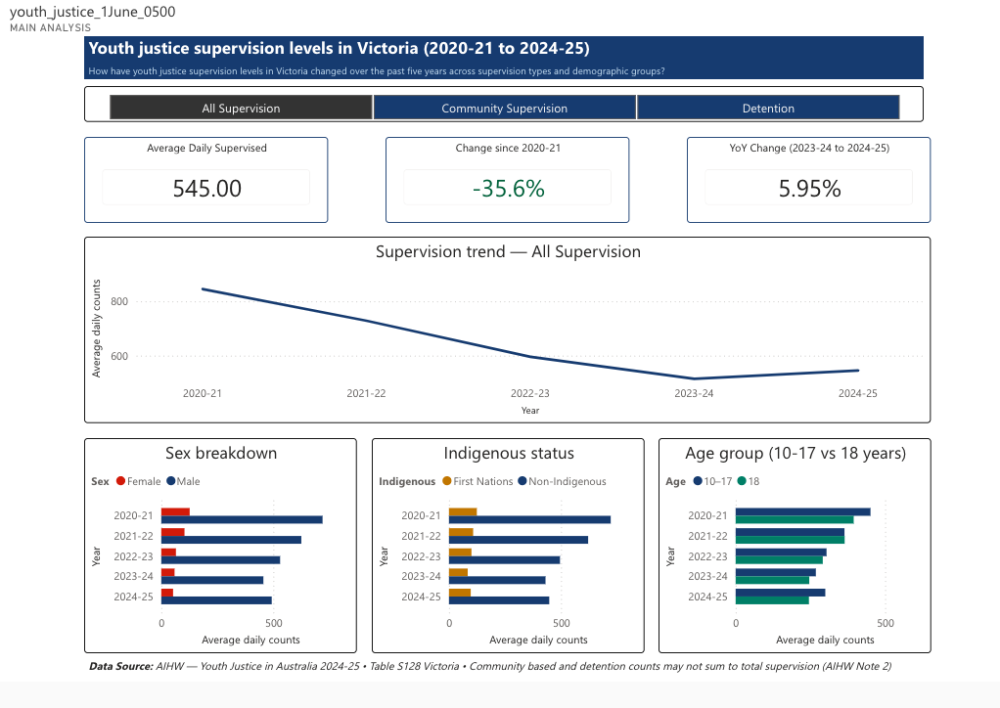
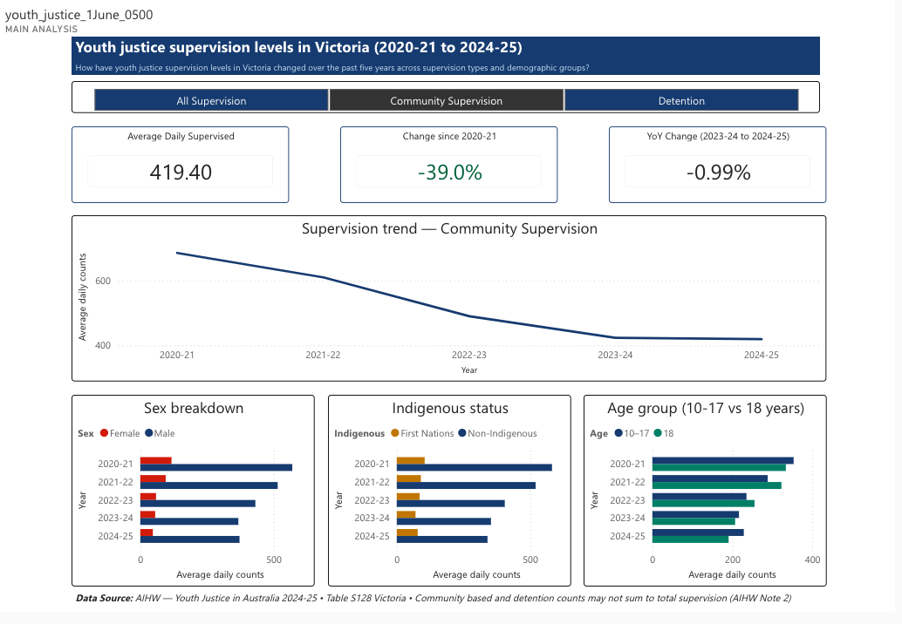
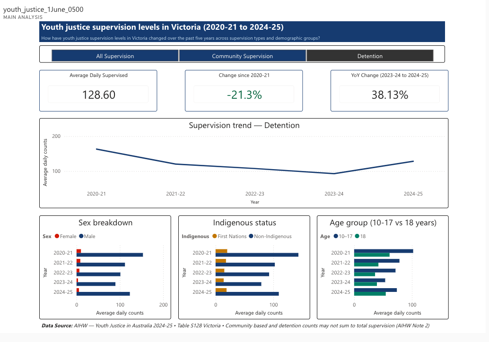

# Youth-Justice-Supervision-Analysis-Dashboard

> Analysing five years of youth justice supervision data in Victoria using SQL, Power BI and Power Query to identify trends, emerging patterns and forecast future supervision demands.

---

## 🔗 Live Interactive Dashboard

---

## 📋 Project Overview

This project analyses youth justice supervision trends in Victoria using Australian Institute of Health and Welfare (AIHW) Youth Justice data from 2020–21 to 2024–25.

The objective was to examine how youth justice supervision levels have changed over the past five years across supervision types and demographic groups, and to communicate findings through an interactive Power BI dashboard supported by SQL-based analysis.

---

## ❓ Business Question

> **What trends and emerging patterns can be identified in youth justice supervision levels in Victoria over the past five years, and what may these trends indicate about future supervision demands?**

---

## 🗂️ Dataset

| Detail | Value |
|---|---|
| **Source** | Australian Institute of Health and Welfare (AIHW) — Youth Justice in Australia 2024–25 |
| **Table** | Table S128 — Victoria |
| **Records** | 2,340 records after data transformation and unpivoting |
| **Reporting period** | 2020–21 to 2024–25 |
| **Measure** | Average daily counts |

**Variables analysed:**
- Year
- Supervision type (All Supervision · Community Supervision · Detention)
- Age (individual ages 10–18 · grouped 10–17 · 14–17 · 10–13)
- Sex (Male · Female · Total)
- Indigenous status (First Nations · Non-Indigenous · Not stated · Total)
- Average daily counts

---

## 🛠️ Tools Used

| Tool | Purpose |
|---|---|
| **SQL (SQLite)** | Data querying · trend analysis · demographic breakdowns |
| **Power BI Desktop** | Interactive dashboard · DAX measures · forecasting |
| **Power Query** | Data transformation · unpivoting · cleaning |
| **Microsoft Excel** | Initial data exploration · validation |

---

## 🧹 Data Preparation

Data preparation steps performed in Power Query:

1. Unpivoted age columns (10, 11, 12 ... Total) into long format — Attribute → Age · Value → Avg_daily_counts
2. Renamed columns — Attribute → Age · Value → Avg_daily_counts
3. Replaced blank values with null in Year and Sex columns then applied Fill Down
4. Replaced em-dash (—) with 0 in Avg_daily_counts · changed data type to Decimal
5. Added Supervision_type column (All Supervision · Community Supervision · Detention) as text
6. Validated against AIHW source — 2,340 rows confirmed

> **Note:** Community-based supervision and detention counts may not sum to total supervision as a young person may be counted in both supervision types on the same day (AIHW Table S128 Note 2). Age data is not comparable with AIHW releases prior to 2019–20 (AIHW Table S128 Note 3).

---

## 🔍 Analysis Performed

### SQL Queries (SQLite)

| Query | Purpose |
|---|---|
| Overall trend | SELECT Year · Supervision type · Avg_daily_counts WHERE Age = All_Ages AND Sex = Total AND Indigenous_status = Total |
| Sex-based analysis | PIVOT on Sex using CASE WHEN · WHERE Age = All_Ages AND Indigenous_status = Total |
| Indigenous status analysis | PIVOT on Indigenous_status using CASE WHEN · WHERE Age = All_Ages AND Sex = Total |
| Age-based analysis | SELECT Year · Supervision_type · Age · Avg_daily_counts WHERE Sex = Total AND Indigenous_status = Total |

All SQL query results verified against source CSV — **195/195 rows matched**.

### Statistical Analysis

- **Year-on-year change** — percentage change between consecutive years
- **Five-year trend** — overall change 2020–21 to 2024–25
- **Linear regression forecast** — forecast 2025–26 with 95% confidence interval
- **Demographic proportions** — First Nations share · sex share · age group share over time

---

## 📊 Key Findings

- Overall youth justice supervision declined from **845.8 to 545.0** average daily supervised young people between 2020–21 and 2024–25 **(−35.6%)**
- **Community supervision** declined by **39.0%** over the same period — continuing to decline in 2024–25
- **Detention** declined overall by **21.3%** but increased sharply by **38.1%** between 2023–24 and 2024–25 — the most significant emerging risk for future supervision demand
- Young people **aged 10–17** drove the 2024–25 uptick — rising from 268.2 to 299.9 (+11.8%) while age 18 continued declining
- **Males** represented substantially higher supervision levels than females — male proportion rose from 85.0% to 90.4% over 5 years
- **First Nations** young people experienced consistently higher supervision levels — their proportion of total supervision rose from 14.7% to 17.8% despite overall numbers declining — a persistent and worsening disparity
- **Forecast 2025–26:** 401.1 average daily supervised young people (95% CI: 131–671) based on linear regression — wide interval reflects small sample size (n=5 years)

---

## 📈 Dashboard Features

- **Supervision type slicer** — toggle between All Supervision · Community Supervision · Detention — all visuals update dynamically
- **4 KPI cards** — average daily supervised · 5-year overall change · YoY change · forecast 2025–26
- **Supervision trend line chart** — five-year trend with linear forecast (dashed) and 95% confidence interval (shaded band)
- **Sex breakdown bar chart** — Male vs Female average daily counts by year
- **Indigenous status bar chart** — First Nations vs Non-Indigenous average daily counts by year
- **Age group bar chart** — Age 10–17 vs Age 18 average daily counts by year
- **Drillthrough page** — Age Group Analysis with detailed 10–17 vs 18 breakdown and policy context

---

## 🖼️ Dashboard Screenshots

### All Supervision

### Community Supervision

### Detention

### Age Group Analysis (Drillthrough)

---

## ⚠️ Limitations

- Data reflects average daily counts — not unique individuals — a young person may be counted across multiple supervision types
- Community-based and detention counts do not sum to total supervision (AIHW Note 2)
- Age data not comparable with AIHW releases prior to 2019–20 (AIHW Note 3)
- Victoria raised the minimum age of criminal responsibility from 10 to 12 in September 2025 — future data may reflect structural changes in who enters the youth justice system

---

## 📁 Repository Contents
